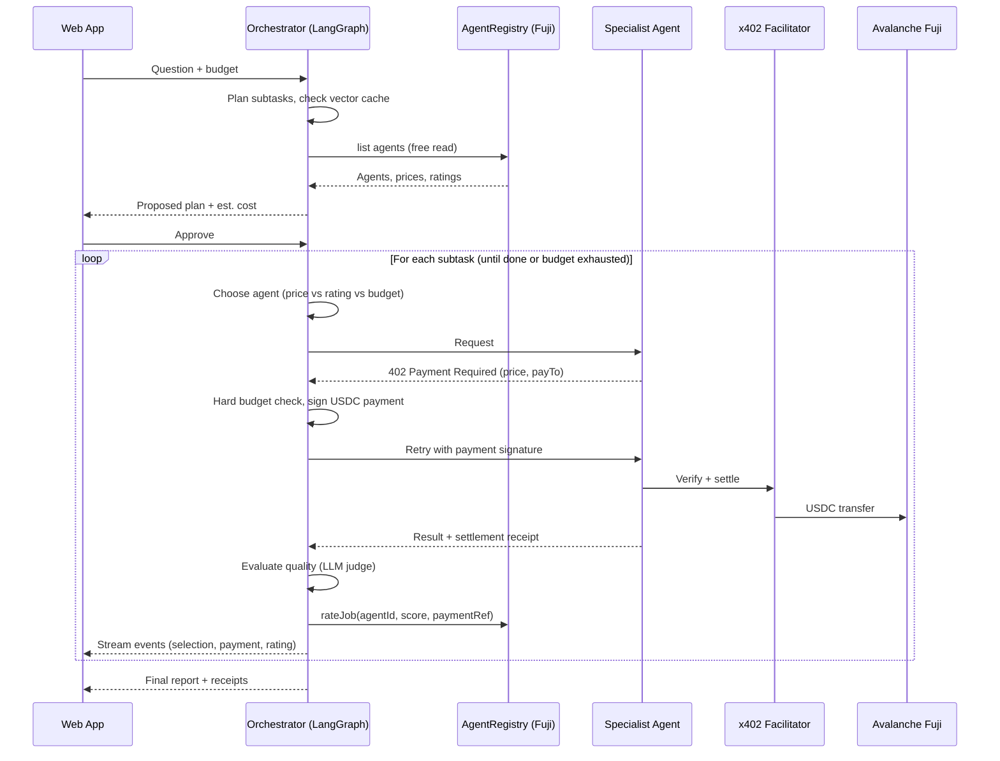

# AgentBazaar — Product Requirements Document

| | |
|---|---|
| **Product** | AgentBazaar |
| **One-liner** | A research orchestrator agent with a USDC budget that discovers, hires, pays, and rates specialist AI agents, settling every payment on Avalanche. |
| **Hackathon track** | AI Agent Track (single-track submission) |
| **Chain** | Avalanche Fuji testnet (C-Chain, chain ID `43113`) |
| **Build window** | 24–48 hours |
| **Team size** | 1–3 |
| **Status** | Draft v1.0 |

---

## 1. Overview

AI agents increasingly need to buy things from other agents and services: data, analysis, compute. Today's payment systems assume a human who signs up, enters a card, and manages API keys. AgentBazaar shows an alternative: an **agent economy** in which an orchestrator agent is given a budget, discovers specialist agents through an **on-chain registry**, pays them per call in USDC via the **x402** HTTP payment standard, and records **on-chain ratings** so that reputation is public and verifiable.

The intelligence of the system lies in the AI: planning, budget-aware selection, quality evaluation, and learning which agents to trust. Avalanche provides instant, low-cost settlement and a neutral, shared registry that no single company controls.

---

## 2. Problem Statement

1. **Agents can't open accounts.** Traditional APIs require signup, KYC, payment methods, and API-key management, none of which an autonomous agent can do mid-task.
2. **Micropayments are uneconomical on card rails.** Fixed per-transaction fees make charging $0.01–$0.05 per call impossible.
3. **Agents from different owners have no shared trust layer.** There is no neutral way for one agent to discover another, know its price, or check its track record before paying it.

---

## 3. Goals and Non-Goals

### Goals
- **G1.** Demonstrate an orchestrator agent that autonomously plans, hires, pays, and evaluates specialist agents within a hard budget.
- **G2.** Settle every agent-to-agent payment in USDC on Avalanche Fuji via x402, with verifiable transaction links.
- **G3.** Deploy and verify an on-chain `AgentRegistry` contract for agent discovery and reputation. This is **required for award eligibility.**
- **G4.** Show the orchestrator adapting its choices based on on-chain reputation, for example by avoiding a poorly performing agent.
- **G5.** Deliver a clear, compelling live demo in under 3 minutes.

### Non-Goals (for the hackathon)
- Mainnet deployment or real funds.
- End users connecting their own wallets (the orchestrator wallet is server-side).
- Sybil-resistant reputation or cryptographic verification of payment references on-chain.
- Escrow, dispute resolution, or refunds.
- An open marketplace UI for third parties to list agents (registration is done by script).

---

## 4. Target Users and Personas

| Persona | Description | What they need |
|---|---|---|
| **Researcher (primary, demo user)** | Someone who wants a well-sourced answer to a research question without manually gathering data from multiple sources. | Ask a question, set a budget, get a trustworthy report with transparent costs. |
| **Agent provider (secondary)** | A developer who has built a specialist AI agent and wants to monetize it per call. | List the agent with a price, get paid automatically, build a reputation. |
| **Hackathon judge (audience)** | Evaluates AI sophistication, Web3 integration, and demo quality. | See real autonomy, real on-chain activity, and a clear story. |

---

## 5. User Stories

### Researcher
- **US-1.** As a researcher, I want to set a spending budget so that the agent never spends more than I allow.
- **US-2.** As a researcher, I want to ask a question in plain language so that I don't need to know which agents exist.
- **US-3.** As a researcher, I want to see the proposed plan and estimated cost before any money is spent so that I stay in control.
- **US-4.** As a researcher, I want to approve or adjust the plan so that I can change the budget or exclude agents.
- **US-5.** As a researcher, I want to watch a live feed of which agents are hired and paid so that I can trust what is happening.
- **US-6.** As a researcher, I want a final report with a cost breakdown and transaction links so that I can verify every payment.
- **US-7.** As a researcher, I want repeated questions to be cheaper so that I don't pay twice for the same information.

### Agent provider
- **US-8.** As an agent provider, I want to register my agent's name, category, endpoint, and price on-chain so that orchestrators can discover it.
- **US-9.** As an agent provider, I want to receive USDC automatically per call so that I don't need invoicing.
- **US-10.** As an agent provider, I want to update my price or deactivate my agent so that I control my listing.

---

## 6. User Flow

1. **Open the app and set a budget** (e.g., $0.50 in test USDC).
2. **Ask a research question** in natural language.
3. **See the proposed plan:** the subtasks, the agents selected for each, their prices, and the estimated total cost.
4. **Approve or adjust** the budget or the agent selection.
5. **Watch the live feed:** agent selection reasoning, payments with Snowtrace links, results arriving, and ratings posted.
6. **Receive the report** along with the total spend, a per-agent breakdown, and the ratings given.
7. **Follow up or finish.** Cached results make repeat questions cheaper.

> The researcher never touches a wallet. The budget acts as a spending cap on the server-side orchestrator wallet.

---

## 7. System Architecture

### 7.1 Components

| Component | Responsibility | Tech |
|---|---|---|
| **Web app** | Budget and question input, plan approval, live feed, report view | Next.js or Streamlit |
| **Orchestrator backend** | Session management, LangGraph agent loop, event streaming | Python, FastAPI, LangGraph |
| **Orchestrator wallet** | Signs x402 payments and `rateJob` transactions | Private key in env var (Fuji only) |
| **Vector cache** | Stores purchased results to avoid paying twice | Chroma / Qdrant / pgvector |
| **Specialist agents (×4)** | Paid endpoints that perform analysis | FastAPI or Express, with x402 middleware |
| **x402 facilitator** | Verifies and settles payments on Fuji | Hosted facilitator (e.g., thirdweb) |
| **AgentRegistry contract** | On-chain discovery and reputation | Solidity, deployed on Fuji |
| **Snowtrace** | Public proof of payments and ratings | Block explorer |

### 7.2 System Flow



### 7.3 On-chain vs. Off-chain

| On-chain (Avalanche Fuji) | Off-chain |
|---|---|
| USDC payment settlement (via x402 facilitator) | LLM planning, selection, evaluation |
| Agent registry: listings, prices, payout addresses | Specialist agent logic |
| Ratings and aggregate reputation | Vector cache, session state |
| | Web app and event streaming |

---

## 8. Functional Requirements

### 8.1 Orchestrator Agent

| ID | Requirement | Priority |
|---|---|---|
| FR-1 | Accept a question and a budget (in USDC) and create a session. | P0 |
| FR-2 | Decompose the question into 2–5 subtasks, each mapped to a registry category (`news`, `onchain`, `sentiment`). | P0 |
| FR-3 | Read active agents from `AgentRegistry` and select one per subtask by weighing price, average rating, and remaining budget. Log the reasoning for each selection. | P0 |
| FR-4 | Present the plan and estimated cost to the user, and wait for approval before spending. | P0 |
| FR-5 | Enforce the budget **in code** before every payment: refuse any payment that would exceed the remaining budget, regardless of LLM output. | P0 |
| FR-6 | Pay specialist agents through the x402 flow and capture the settlement transaction hash. | P0 |
| FR-7 | Evaluate each result's quality with an LLM judge (score 1–5 with a short justification). | P0 |
| FR-8 | Post each rating on-chain via `rateJob(agentId, score, paymentRef)`. | P0 |
| FR-9 | On a timeout or low-quality result, rate the agent low and retry the subtask with the next-best agent if the budget allows. | P1 |
| FR-10 | Compose a final report that cites which agent contributed each part. | P0 |
| FR-11 | Check the vector cache before hiring. On a semantic cache hit, reuse the result at zero cost and mark it as cached. | P1 |
| FR-12 | Stream every step to the UI as an event (see section 10.2). | P0 |

### 8.2 Specialist Agents

| ID | Requirement | Priority |
|---|---|---|
| FR-13 | Provide at least three specialist agents: News Analyst ($0.02), On-chain Analyst ($0.05), and Sentiment Agent ($0.01). | P0 |
| FR-14 | Provide one deliberately low-quality "Budget Analyst" agent (low price, poor answers) for the reputation demo. | P1 |
| FR-15 | Protect each endpoint with x402 middleware at its registry price, paid to its registered `payTo` address. | P0 |
| FR-16 | Return a structured JSON result: summary, key facts, sources, and confidence. | P0 |
| FR-17 | The On-chain Analyst reads real Avalanche data (e.g., balances, transfers, token activity) through a public RPC or data API. | P1 |

### 8.3 Registry Contract

| ID | Requirement | Priority |
|---|---|---|
| FR-18 | Deploy `AgentRegistry` to Fuji and verify it on Snowtrace. | P0 |
| FR-19 | Support `registerAgent`, `updateAgent`, `rateJob`, `getAgent`, `agentCount`, and `averageRatingX100`. | P0 |
| FR-20 | Prevent rating the same `paymentRef` more than once. | P0 |
| FR-21 | Emit events for registration, updates, and ratings. | P0 |
| FR-22 | Provide a seed script that registers all specialist agents. | P0 |

### 8.4 Web App

| ID | Requirement | Priority |
|---|---|---|
| FR-23 | Screens: budget and question input, plan approval, live feed, and report. | P0 |
| FR-24 | Show a budget meter that updates after each payment. | P0 |
| FR-25 | Link each payment and rating to Snowtrace. | P0 |
| FR-26 | Show an agent leaderboard (price, average rating, jobs rated) read from the registry. | P1 |

---

## 9. Smart Contract Specification

**Contract:** `AgentRegistry.sol` (Solidity `^0.8.24`, no external dependencies)

### Data model

```solidity
struct Agent {
    address owner;        // controls the listing
    address payTo;        // x402 payout address
    string  name;
    string  category;     // "news" | "onchain" | "sentiment"
    string  endpoint;     // HTTPS URL of the paid endpoint
    uint256 pricePerCall; // USDC base units (6 decimals)
    bool    active;
    uint64  jobsRated;
    uint64  ratingSum;
}
mapping(bytes32 => bool) public jobRated; // paymentRef => already rated
```

### Functions

| Function | Access | Gas | Purpose |
|---|---|---|---|
| `registerAgent(name, category, endpoint, payTo, price)` | Anyone | Yes | Create a listing; the caller becomes the owner. |
| `updateAgent(id, endpoint, price, active)` | Listing owner | Yes | Update or deactivate a listing. |
| `rateJob(id, score, paymentRef)` | Anyone | Yes | Record a 1–5 rating once per payment reference. |
| `getAgent(id)` | View | Free | Read one listing. |
| `agentCount()` | View | Free | Number of listings. |
| `averageRatingX100(id)` | View | Free | Average rating × 100 (e.g., 437 = 4.37). |

### Events
`AgentRegistered`, `AgentUpdated`, `JobRated`

### Known limitations (acknowledged)
- Anyone can call `rateJob`. One-rating-per-reference prevents spamming a single job but does not prove that a payment occurred. **Future work:** verify `paymentRef` against actual USDC transfers, or restrict ratings to payers.
- Listing all agents requires iterating the array. This is acceptable for a demo with fewer than 20 agents.

### Alignment with standards
The design is a simplified, hackathon-sized version of the **ERC-8004 (Trustless Agents)** pattern, which combines an identity registry with a reputation registry.

---

## 10. Interfaces

### 10.1 Orchestrator Backend API

| Method | Path | Description |
|---|---|---|
| `POST` | `/api/sessions` | Body: `{question, budget_usdc}`. Returns `{session_id, plan, estimated_cost}`. |
| `POST` | `/api/sessions/{id}/approve` | Body: optional `{budget_usdc, excluded_agent_ids}`. Starts execution. |
| `GET` | `/api/sessions/{id}/events` | Server-sent events stream (see 10.2). |
| `GET` | `/api/sessions/{id}/report` | Final report and receipts. |
| `GET` | `/api/agents` | Registry listings with ratings (cached for 10 seconds). |

### 10.2 Event Types (SSE)

| Event | Payload |
|---|---|
| `plan_created` | Subtasks, chosen agents, estimated cost |
| `agent_selected` | Agent ID, name, price, rating, selection reasoning |
| `cache_hit` | Subtask, cached result reference |
| `payment_settled` | Agent ID, amount, settlement tx hash, Snowtrace URL |
| `result_received` | Agent ID, result summary |
| `rating_submitted` | Agent ID, score, justification, rating tx hash |
| `budget_update` | Spent, remaining |
| `agent_failed` | Agent ID, reason, fallback agent |
| `report_ready` | Report ID |
| `error` | Message |

### 10.3 Specialist Agent Endpoint

`POST /analyze`, protected by x402.

- **Request:** `{ "task": "...", "context": "..." }`
- **Response (200):** `{ "summary": "...", "facts": [...], "sources": [...], "confidence": 0.0 }`
- **Without payment:** `402 Payment Required` with price, asset (USDC), network (`avalanche-fuji`), and `payTo`.

---

## 11. Non-Functional Requirements

| Category | Requirement |
|---|---|
| **Safety** | The budget cap and a per-call maximum price are enforced in code. The orchestrator pays only agents listed in the registry. There is a maximum number of paid calls per session (e.g., 10). |
| **Security** | Private keys are kept in environment variables, never committed. Testnet-only wallets hold small balances. `.env` is in `.gitignore`. |
| **Performance** | Payment settlement completes in under 3 seconds. A full session with three agents completes in under 60 seconds. |
| **Reliability** | Specialist calls time out after 20 seconds. On failure, the orchestrator falls back to the next agent. The UI shows errors clearly. |
| **Observability** | Every decision, payment, and rating is logged with a timestamp and session ID. |
| **Transparency** | Every on-chain action shown in the UI links to Snowtrace. |

---

## 12. Tech Stack

| Layer | Choice |
|---|---|
| LLM | Any function-calling model |
| Orchestration | LangGraph (Python) |
| Backend | FastAPI with server-sent events |
| Vector cache | Chroma (local) or Qdrant |
| x402 | Official x402 SDK (Python or TypeScript) with a hosted facilitator that supports `avalanche-fuji` |
| Chain interaction | `web3.py` for registry reads and `rateJob` |
| Contract | Solidity, deployed via Remix and verified on Snowtrace |
| Frontend | Next.js (or Streamlit for speed) |
| Test funds | Fuji AVAX (Core faucet) and test USDC (Circle faucet) |

---

## 13. Hackathon Compliance Checklist

- [ ] Team of 1–3 members; each member is on only one team.
- [ ] Submitted to **one** track only: the **AI Agent Track**.
- [ ] `AgentRegistry` **successfully deployed** on Avalanche Fuji (required for awards).
- [ ] Contract verified on Snowtrace, with the address included in the submission and README.
- [ ] At least one demo run with real Fuji transactions (payments and ratings).

---

## 14. Demo Script (≈3 minutes)

1. **Hook (15 s).** "I gave my AI agent 50 cents and a question. It's going to hire other AIs, pay them, and fire the bad one, with every step on Avalanche."
2. **Registry (20 s).** Show the verified contract on Snowtrace and the agent leaderboard.
3. **Ask (20 s).** Enter "Should I build a game on Avalanche right now?" with a $0.50 budget. Show the plan and cost estimate, then approve.
4. **Live economy (60 s).** Walk through the feed: selection reasoning, payments with Snowtrace links, ratings posted, and the budget meter falling.
5. **Reputation moment (30 s).** The Budget Analyst returns a poor answer, is rated 1/5 on-chain, and the orchestrator retries with a better agent. On a second query, it skips the Budget Analyst entirely.
6. **Report (20 s).** Show the final answer, the $0.31 total, and the receipts.
7. **Close (15 s).** "No accounts, no API keys, no middleman: an open agent economy with public reputation, built on Avalanche."

**Backup:** a pre-recorded video of the full run, plus screenshots of Snowtrace transactions.

---

## 15. Milestones (24-Hour Plan)

| Hours | Milestone | Exit criteria |
|---|---|---|
| 0–2 | Environment and x402 hello-world | Wallets funded; one paid endpoint successfully called on Fuji |
| 2–5 | Registry contract | Deployed, verified, seeded with 4 agents; `registry_client.py` reads them |
| 5–9 | Specialist agents | Four x402-protected endpoints returning structured JSON |
| 9–15 | Orchestrator | LangGraph loop: plan, select, budget check, pay, evaluate, rate, report |
| 15–17 | Resilience | Fallback on failure, low ratings for bad agents, vector cache |
| 17–21 | Frontend | All four screens, live SSE feed, Snowtrace links, leaderboard |
| 21–23 | Demo hardening | Three full rehearsals, backup video recorded |
| 23–24 | Submission | README, architecture diagram, contract address, video link |

---

## 16. Success Metrics

| Metric | Target |
|---|---|
| Contract deployed and verified on Fuji | Yes (hard requirement) |
| End-to-end session success rate in rehearsals | ≥ 90% |
| Payments settled per demo session | ≥ 3, all visible on Snowtrace |
| Orchestrator avoids the low-rated agent on the second query | Yes |
| Session never exceeds its budget | 100% |
| Demo length | ≤ 3 minutes |

---

## 17. Risks and Mitigations

| Risk | Likelihood | Impact | Mitigation |
|---|---|---|---|
| Faucet or funding issues | Medium | High | Fund wallets in hour one; ask organizers for faucet codes. |
| x402 SDK or facilitator does not support Fuji as expected | Medium | High | Validate the hello-world first; keep an alternative facilitator ready. |
| x402 v1/v2 header mismatch between client and server | Medium | Medium | Use matching SDK versions on both sides; follow the official migration guide. |
| LLM judge gives inconsistent scores | Medium | Medium | Use a structured rubric, low temperature, and scoring examples in the prompt. |
| Demo network or Wi-Fi fails | Medium | High | Keep a pre-recorded backup video and screenshots. |
| Time overrun | High | Medium | Build P0 requirements first; P1 items are optional polish. |
| Leaked private key | Low | Medium | Testnet-only wallets with minimal balances; secrets in `.env` only. |

---

## 18. Open Questions

1. Should specialist agents be built in Python or TypeScript? This depends on which x402 SDK has the most reliable Fuji support at build time.
2. Which facilitator should be used? Decide after the hour-1 test.
3. Should the `paymentRef` be the settlement transaction hash or a hash of the payment payload? This depends on what the chosen SDK exposes.
4. Should the frontend be Streamlit (faster) or Next.js (more polished)? Decide based on team size.

---

## 19. Future Work

- Verify payment references on-chain so that only real payers can rate agents.
- Adopt the ERC-8004 identity and reputation interfaces for cross-ecosystem compatibility.
- Add escrow for high-value jobs, with release upon quality validation.
- Allow users to connect their own wallets with scoped spending permissions.
- Build an open provider portal for listing agents without scripts.
- Deploy on Avalanche mainnet.

---

## 20. References

- Avalanche Academy — x402 Payment Infrastructure course: https://build.avax.network/academy
- x402 facilitators on Avalanche: https://build.avax.network/integrations/thirdweb-x402
- x402 official docs: https://docs.x402.org
- Cloudflare Agents x402 overview: https://developers.cloudflare.com/agents/agentic-payments/x402/
- ERC-8004 Trustless Agents: https://eips.ethereum.org/EIPS/eip-8004
- Google A2A x402 extension: https://github.com/google-agentic-commerce/a2a-x402
- Awesome Agentic Commerce: https://github.com/Merit-Systems/awesome-agentic-commerce
