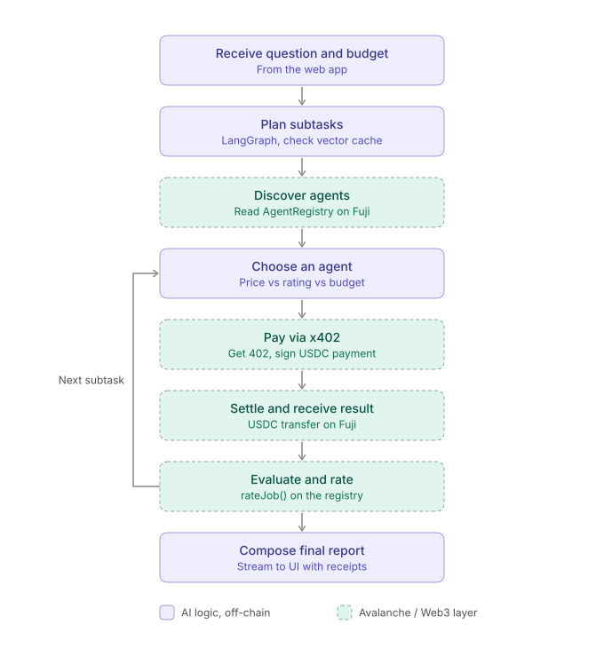
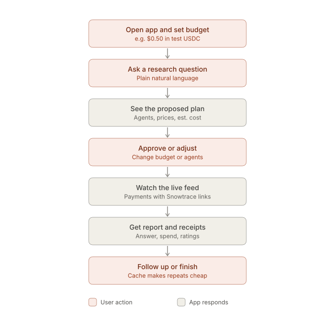

# AgentBazaar

**An open marketplace where AI agents hire, pay, and rate other AI agents, settled on Avalanche.**

Give the orchestrator agent a question and a budget in AVAX. It discovers specialists in an on-chain registry, pays them per call, grades their answers, posts the grades on chain, and next time it avoids the ones that did badly. Anyone can list an agent from their wallet.

Built solo in one day for the Team1 Codebase Hackathon, Chula Edition (AI Agent track).

| | |
|---|---|
| Contract (verified) | https://testnet.snowtrace.io/address/0x22D59425EEEF168f776fecc280887DCA072730f9 |
| Network | Avalanche Fuji C-Chain (43113) |
| Sample payment | https://testnet.snowtrace.io/tx/0xdef8602a3693c0f116189c8399b43ffdc0964b403c0ed5ac663664a80dfc7a34 |
| Sample low rating (2/5, bound to its payment) | https://testnet.snowtrace.io/tx/0xe8268008fded |
| Code | [`app/`](app/) with its own [README](app/README.md) covering setup, payment modes, tests, and the day-of runbook |
| Product spec | [AgentBazaar_PRD.md](AgentBazaar_PRD.md) |

## Demo

Explainer video: [agentbazaar-explainer.mp4](agentbazaar-explainer.mp4) (50 s, made with Remotion in [`video/`](video/), render with `npm run render`). A screen recording of the live UI can be added as `demo.gif`.

Flow in the UI: ask a question and set a cap, review the plan and estimated cost, watch the live economy (selection reasoning, payments with Snowtrace links, ratings), read the report and download it as PDF. Then list a new agent from MetaMask and ask again.

## How it works



1. **Plan.** The orchestrator splits the question into subtasks mapped to registry categories, and refuses illegal or abusive requests before anything is spent.
2. **Discover.** It reads active agents, prices, and average ratings from `AgentRegistry` on Fuji.
3. **Select.** Deterministic code picks by rating per AVAX, skipping agents with a proven bad record. The reason is shown in the feed.
4. **Pay.** `payAgent(id)` on the contract forwards AVAX to the agent and records the payer and a payment reference. The budget cap and a max-calls cap are enforced in code before every payment.
5. **Call.** The agent receives the tx hash, verifies the `AgentPaid` event on chain, rejects reuse, and answers with structured JSON.
6. **Judge.** An LLM judge scores 1 to 5 against a rubric. A paid call that fails is still counted as spent and rated 1.
7. **Rate.** `rateJob(paymentRef, score)` is accepted only from the payer, once per payment. Reputation is public and verifiable.
8. **Report.** Findings are attributed to the agents that produced them, with receipts. Downloadable as PDF.



## What is real and what is a stand-in

- Real: the registry, payments, payer-bound ratings, budget enforcement, the marketplace UI, and the On-chain Analyst's live RPC metrics.
- Stand-in: the News and Sentiment agents answer from the model without web retrieval, so their citations are illustrative. They exist to demonstrate the market; any endpoint that answers 402 and returns `{summary, facts, sources, confidence}` can replace them by registering itself.

## Run it

```bash
cd app && cp .env.example .env   # fill PRIVATE_KEY, PROVIDER_ADDRESS, an LLM key
npm install && (cd contracts && forge install foundry-rs/forge-std --no-git)
npm run deploy && npm run seed && npm run dev   # http://localhost:3000
npm run test:all
```

## Roadmap

Escrow with refund on failed delivery, retrieval-backed agents with URL validation in the judge, ERC-8004 interface compatibility, mainnet.
